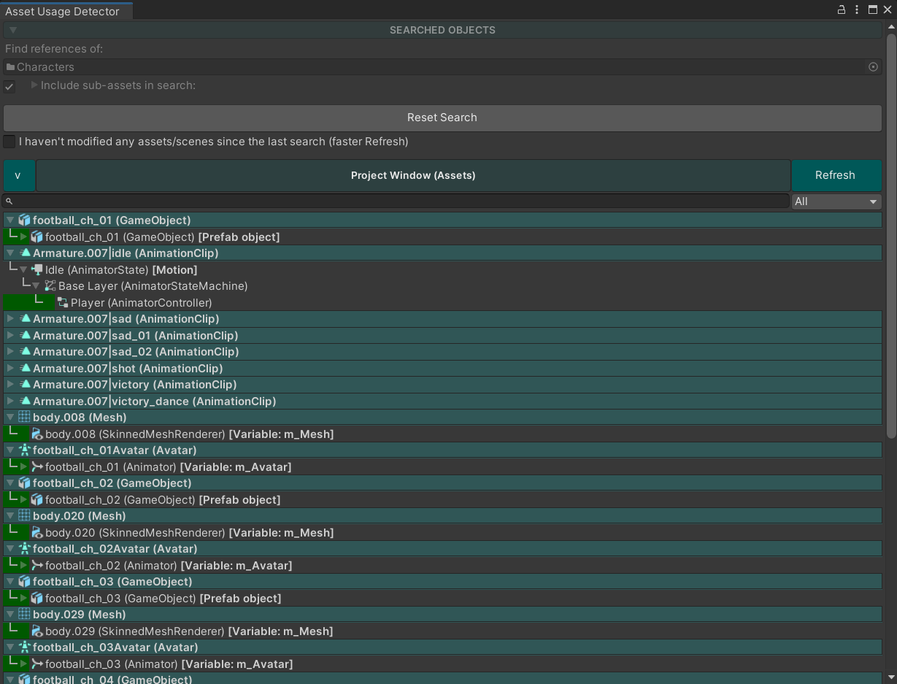
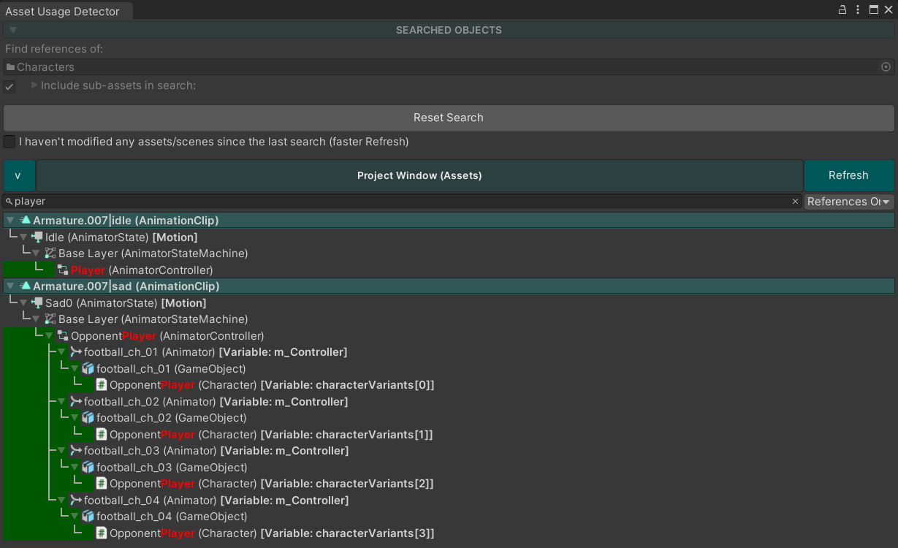
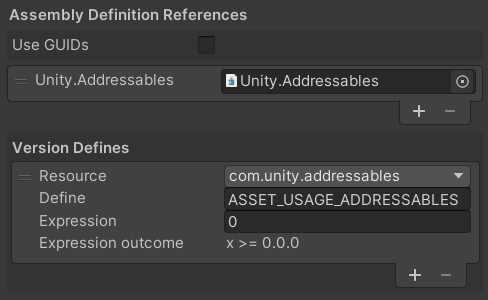

# Asset Usage Detector for Unity 3D


**Available on Asset Store:** https://assetstore.unity.com/packages/tools/utilities/asset-usage-detector-112837

**Forum Thread:** https://forum.unity.com/threads/asset-usage-detector-find-references-to-an-asset-object-open-source.408134/

**Discord:** https://discord.gg/UJJt549AaV

**[Support the Developer ☕](https://yasirkula.itch.io/unity3d)**

## ABOUT

This tool helps you find usages of the selected asset(s) and/or scene object(s), i.e. lists the objects that refer to them. It is possible to search for references in the Assets folder (Project view) and/or in the scene(s) of your project. You can also search for references while in Play mode!

## INSTALLATION

There are 5 ways to install this plugin:

- import [AssetUsageDetector.unitypackage](https://github.com/yasirkula/UnityAssetUsageDetector/releases) via *Assets-Import Package*
- clone/[download](https://github.com/yasirkula/UnityAssetUsageDetector/archive/master.zip) this repository and move the *Plugins* folder to your Unity project's *Assets* folder
- import it from [Asset Store](https://assetstore.unity.com/packages/tools/utilities/asset-usage-detector-112837)
- *(via Package Manager)* add the following line to *Packages/manifest.json*:
  - `"com.yasirkula.assetusagedetector": "https://github.com/yasirkula/UnityAssetUsageDetector.git",`
- *(via [OpenUPM](https://openupm.com))* after installing [openupm-cli](https://github.com/openupm/openupm-cli), run the following command:
  - `openupm add com.yasirkula.assetusagedetector`

## HOW TO

- Open **Window - Asset Usage Detector** window, configure the settings and hit **GO!**
  - or, right click an object and select **Search For References**
- To learn how to interpret the search results and for more instructions, please see the included [README.txt](../Plugins/AssetUsageDetector/README.txt) file
- You can tweak most settings/colors via *Project Settings/yasirkula/Asset Usage Detector* page (on older versions, this menu is located at *Preferences* window)





## ADDRESSABLES SUPPORT

This plugin has experimental support for *Addressables* package. However, the search may take significantly longer to finish when Addressables are searched. Some manual modifications are needed to enable Addressables support:

- The plugin mustn't be installed as a package, i.e. it must reside inside the *Assets* folder and not the *Packages* folder (it can reside inside a subfolder of Assets like *Assets/Plugins*)
- Modify the **AssetUsageDetector.Editor** Assembly Definition File as follows:



- If *Version Defines* isn't present (on older Unity versions), manually add `ASSET_USAGE_ADDRESSABLES` compiler directive to **Player Settings/Scripting Define Symbols** (these symbols are platform specific, so if you change the active platform later, you'll have to add the compiler directive again)
- Enable the "Addressables support" option in Asset Usage Detector window

## SEARCH REFACTORING

While searching for references using the Scripting API, it's possible to get notified of the found references *during* the search (some references like *Assembly Definition File* references or *Shader Graph* references aren't supported) and in most cases, refactor them (e.g. changing all usages of a searched object with something else or *null*). Disabling *Lazy Scene Search* is recommended while using this feature and it's advised to backup your project beforehand.

To initiate a search using the Scripting API, you need to put your script either in *Editor* folder or add `AssetUsageDetector.Editor` as reference to your *Assembly Definition File*. Then, you can either create a new instance of `AssetUsageDetectorNamespace.AssetUsageDetector` object and call its `Run` method, or call the `AssetUsageDetectorNamespace.AssetUsageDetectorWindow.ShowAndSearch` method. In either case, you'll be handling the search refactoring in the **searchRefactoring** callback:

```csharp
void ReplaceFontUsages( Font from, Font to )
{
	AssetUsageDetector assetUsageDetector = new AssetUsageDetector();
	assetUsageDetector.Run( new AssetUsageDetector.Parameters()
	{
		objectsToSearch = new Object[] { from },
		lazySceneSearch = false,
		searchRefactoring = ( searchMatch ) =>
		{
			Debug.LogFormat( "Found a {0} reference from {1} to {2}", searchMatch.GetType().Name, searchMatch.Source, searchMatch.Value );
			searchMatch.ChangeValue( to );
		}
	} );
}
```

**NOTE:** Refactored references won't be reflected to the returned search results, old references will continue to be displayed. After saving the changes (modified scenes) and initiating another search, correct search results will be shown.

**NOTE2:** After refactoring the references, consider performing a normal search to see if all references were correctly refactored. If some references weren't refactored (even though they could've been), feel free to report it.

## KNOWN LIMITATIONS

- *Addressables* aren't supported
- *static* variables aren't searched
- *Resources.Load* usages can't be found
- *GUIText* materials aren't searched
- Textures in *Lens Flares* can't be searched
