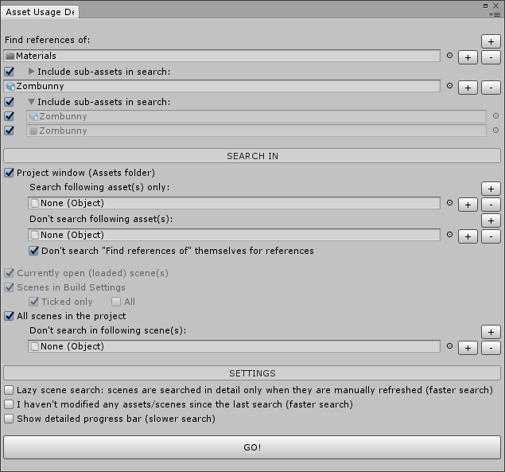

# Asset Usage Detector for Unity 3D

**Available on Asset Store:** https://assetstore.unity.com/packages/tools/utilities/asset-usage-detector-112837

**Forum Thread:** https://forum.unity.com/threads/asset-usage-detector-find-references-to-an-asset-object-open-source.408134/

**[Support the Developer ☕](https://yasirkula.itch.io/unity3d)**

## ABOUT

This editor extension helps you figure out at which places an asset or GameObject is used, i.e. lists the objects that refer to the asset. It is possible to search for references in the Assets folder (Project view) and/or in the scene(s) of your project. You can also search for references while in Play mode!

## INSTALLATION

There are 5 ways to install this plugin:

- import [AssetUsageDetector.unitypackage](https://github.com/yasirkula/UnityAssetUsageDetector/releases) via *Assets-Import Package*
- clone/[download](https://github.com/yasirkula/UnityAssetUsageDetector/archive/master.zip) this repository and move the *Plugins* folder to your Unity project's *Assets* folder
- import it from [Asset Store](https://assetstore.unity.com/packages/tools/utilities/asset-usage-detector-112837)
- *(via Package Manager)* add the following line to *Packages/manifest.json*:
  - `"com.yasirkula.assetusagedetector": "https://github.com/yasirkula/UnityAssetUsageDetector.git",`
- *(via [OpenUPM](https://openupm.com))* after installing [openupm-cli](https://github.com/openupm/openupm-cli), run the following command:
  - `openupm add com.yasirkula.assetusagedetector`

## HOW TO

- Open **Window - Asset Usage Detector** window, configure the settings and hit **GO!**
  - or, right click an object and select **Search For References**
- In the search results page, each row represents a reference to the searched Object(s). Rows can be traversed from left to right to see how the references are formed. If a node's label contains text inside square brackets (e.g. *\[Child object\]*), then that text describes how that node is connected to the node to its left

## FEATURES

- You can search for references of any object that extends *UnityEngine.Object*
- Extensive search algorithm that uses *SerializedObject* and *reflection* to find references
- Can search in multiple scenes at once
- Can show complete paths to the references or only the most relevant parts of the paths (see the demonstration below)

## KNOWN LIMITATIONS

- *static* variables are not searched
- GUIText materials are not searched
- Textures in Lens Flare's can not be searched
