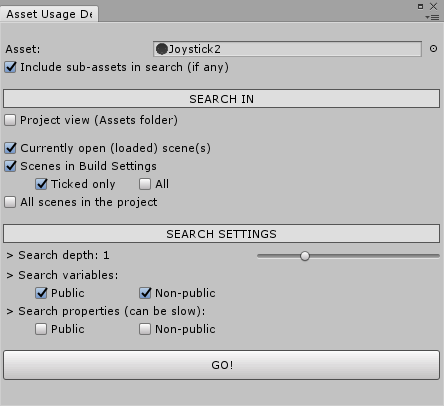
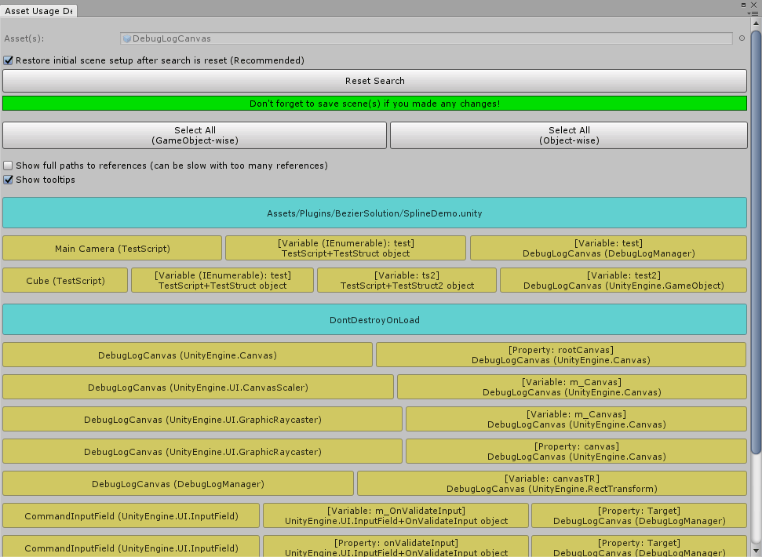

# Asset Usage Detector for Unity 3D

### A. ABOUT

This editor extension helps you figure out at which places an asset or GameObject is used, i.e. lists the objects that refer to the asset. It is possible to search for references in the Assets folder (Project view) and/or in the scene(s) of your project. You can also search for references while in Play mode!

### B. HOW TO USE
- Simply put the **AssetUsageDetector.cs** script into the *Editor* folder of your project (if "Editor" folder does not exist, create it manually)
- Now open **Window - Asset Usage Detector** window and you are good to go!

### C. FEATURES

- You can search for references of any object that extends *UnityEngine.Object*
- Seaches every corner of your project with its *reflection* based search algorithm (even non-Unity objects, structs and data types like dictionaries are searched)
- Can search in multiple scenes at once
- Can show complete paths to the references or only the most relevant parts of the paths (see demonstration below)

### D. KNOWN LIMITATIONS
- *static* variables are not searched
- GUIText materials are not searched
- Textures in Lens Flare's can not be searched
