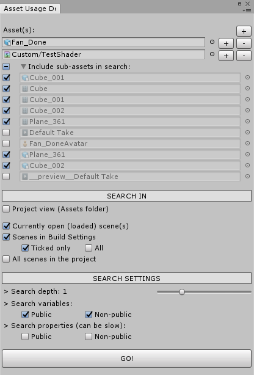
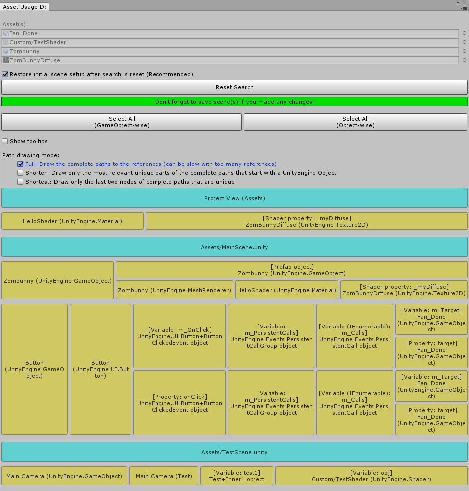

# Asset Usage Detector for Unity 3D

**Available on Asset Store:** https://www.assetstore.unity3d.com/en/#!/content/112837

**Forum Thread:** https://forum.unity.com/threads/asset-usage-detector-find-references-to-an-asset-object-open-source.408134/

### A. ABOUT

This editor extension helps you figure out at which places an asset or GameObject is used, i.e. lists the objects that refer to the asset. It is possible to search for references in the Assets folder (Project view) and/or in the scene(s) of your project. You can also search for references while in Play mode!

### B. HOW TO USE

- Import [AssetUsageDetector.unitypackage](https://github.com/yasirkula/UnityAssetUsageDetector/releases) to your project
- Open **Window - Asset Usage Detector** window, configure the settings and hit **GO!**
  - or, right click an object and select **Search For References**

### C. FEATURES

- You can search for references of any object that extends *UnityEngine.Object*
- Extensive search algorithm that uses *SerializedObject* and *reflection* to find references
- Can search in multiple scenes at once
- Can show complete paths to the references or only the most relevant parts of the paths (see the demonstration below)

### D. KNOWN LIMITATIONS

- *static* variables are not searched
- GUIText materials are not searched
- Textures in Lens Flare's can not be searched